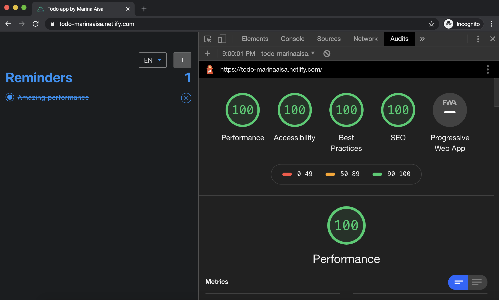

# Todo app by Marina Aisa

## ⚡️ Live
Check this project live at [todo-marinaaisa.netlify.com](https://todo-marinaaisa.netlify.com/)

## 💻 Technology Used

- **[Nuxt.js](https://nuxtjs.org/)** is the biggest framework on top of **[Vue.js](https://vuejs.org/)** to generate *SPA* and *universal* SPAs. Since this webapp doesn't have much of static information, I don't need to index the content on Google and I need access to localStorage, I'm using the SPA mode. **You can read more about the differences between static and SPA [in this article I wrote](https://marinaaisa.com/blog/cook-websites-based-on-your-needs).**

- **[Nuxt-i18n](https://github.com/nuxt-community/nuxt-i18n)** as a Nuxt's pluging on top of [vue-i18n](https://kazupon.github.io/vue-i18n/) for i18n features.

- **[Vuex](https://vuex.vuejs.org/)** as state management library.

- **[Jest](https://jestjs.io/)** and **[Vue Tests Utils](https://vue-test-utils.vuejs.org/)** as testing frameworks and utils.

- **[SCSS](https://sass-lang.com/)** as CSS preprocessor.

- **[LocalStorage](https://developer.mozilla.org/es/docs/Web/API/Window/localStorage)** to save user's tasks in their browser and restore data when page is reload.

- **[ESLint](https://eslint.org/)** to format the code.

- **[Netlify](https://eslint.org/)** for deployment.

## ✏️ Design:
Its design is inspired on [Reminders app](https://support.apple.com/en-in/HT205890) (dark theme) by Apple.

## 🔗 Features:
- Adding new tasks
- Marking tasks as complete
- Marking tasks as incomplete (un-mark a previously complete task)
- Deleting tasks
- Saving tasks on LocalStorage
- Displaying number of tasks
- Web accessibility
- i18n in English and Spanish
- 100% score on web performance, accessibility, best practices and SEO on [Lighthouse](https://developers.google.com/web/tools/lighthouse)'s audits:


## 🔍 Web Accessibility:
For checking web accessibility you can use [this advance tool for Chrome](https://chrome.google.com/webstore/detail/siteimprove-accessibility/efcfolpjihicnikpmhnmphjhhpiclljc).

- Aria-labels describe needed information when no text is available.
- Keyboard-based operation is implemented and focus styles are displayed.
- User can skip the header on "Skip to content" when starting to tab on the website.
- Fieldset is defined for the list of tasks.
- Color contrast ratio between text and background is always higher than 4.5.
- Landsmarks are applied.

## 🚀 Get Up and Running


1. **Download this repository and go to its folder**

    ```shell
    git clone git@github.com:marinaaisa/nuxt-todo-app.git && cd nuxt-todo-app
    ```

2. **Install dependencies**

    ```shell
     npm install
     ```

3. **Run a local server with hot reload at [localhost:3000](localhost:3000)**

    ```shell
    npm run dev
    ```


## 🛠 Available Scripts

Run unit tests made with [Jest](https://jestjs.io/):
```shell
  npm run test
```

Build SPA for production:
```shell
  npm run build
```

Find syntax errors. I use [ESLint](https://eslint.org/):
```shell
  npm run lint
```

Autofix linter:
```shell
  npm run fix-lint
```
